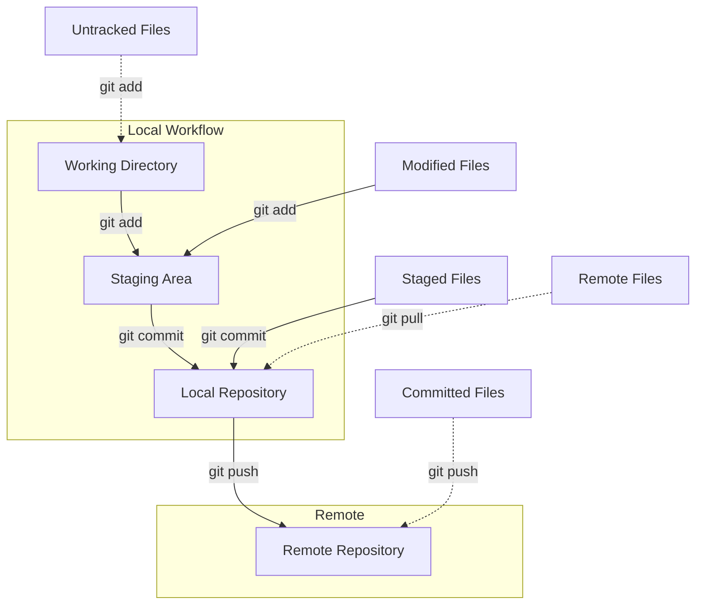

# Консоль. Основные инструменты и практики

## Вводная информация и базовые знания
* **Речь только про Linux.** Точнее, про операционные системы, поддерживающие стандарт POSIX. В Windows своя особая магия, если вы ей владеете — пишите дополнения и присылайте pull request к этому документу.
* **Освойте концепцию каталогов (директориев).** Нужно уметь переходить по каталогам. Смотреть, где вы находитесь прямо сейчас. Отличать каталог исполнения программы от каталога терминала. Понимать идею предок-потомок.
* **Познакомьтесь с концепцией прав.** Особенно прав на исполнение. Коротко: некоторые файлы от вас защищены, даже если вы их сами и создали, но это можно менять.
* **Терминал всё равно потребуется.** Обойтись одними только GUI-инструментами (то есть мышкой и окошками) не выйдет. Просто не сможете писать код. Так что заставляйте себя привыкать к терминалу.
* **Терминал и консоль — одно и то же.** Программы для входа в терминальный режим есть во всех доступных вам операционных системах. И в Windows тоже.

## Команды bash
| Команда | Что делает |
| -- | -- |
| `ls` | Вывести список файлов в текущем каталоге. Полезный вариант: `ls -la` — показывает все файлы, в том числе начинающиеся с точки (скрытые), а также права и другие детали. |
| `cd <путь_к_каталогу>` | Перейти в другой каталог; `cd /` — в корень системы (туда обычно не нужно); `cd` — в свой домашний директорий (нужно часто); `cd ..` — на уровень выше (нужно очень часто). |
| `pwd` | Показать абсолютный путь к тому каталогу, в котором вы сейчас находитесь. |
| `mkdir <имя_нового_каталога>` | Создать каталог. |
| `ln <путь_к_файлу> <псевдоним>` | Создать псевдоним файла; чтобы не бродить по каталогам, лучше сделать псевдонимы к далёким файлам: `ln -s ../build/Quest_3 q` — и вы сможете запускать программу командой `./q`. |
| `rm <удаляемый_файл_или_каталог>` | Удалить; поддерживает шаблоны; команда `rm -rf <каталог>` удаляет каталог и не запрашивает подтверждений; `rm -f *.c` удаляет все файлы с расширением `.c` и не спрашивает подтверждений; **никогда** не запускайте `rm -rf *`, будьте предельно внимательны! |
| `wc` | Считалка разного в текстовом файле; `wc -l <адрес_файла>` посчитает количество строк в файле (можно хвастаться, какая у вас длинная программа). |
| `cat <адрес_файла>` | Выводит файл на экран; если слишком длинный — `<пробел>` для следующей страницы, `q` для выхода. |
| `more` | То же, что `cat`. |
| `man <команда_системы>` | Выводит короткую инструкцию к команде или программе; в форме `man 3 <оператор_с>` можно пользоваться как справкой по C, даже если нет выхода в сеть (например, на экзамене). |
| `ps` | Выводит список работающих в системе процессов; миллион флагов, но разбираться придётся самостоятельно. |
| `kill <id_процесса>` | Убивает процесс; полезно, если ваша программа не хочет останавливаться; лучше запускать с флагом `-9`. |
| `chmod` | Изменить права файла; для запуска скрипта нужно дать файлу этого скрипта права на запуск: `chmod +x <файл_скрипта>`; чтобы не париться, можно сразу `chmod 777 *` (сисадминам не показывайте, удар хватит). |
| `grep` | Поиск в тексте строк, содержащих шаблон или кусок текста; часто используется как фильтр для длинной выдачи или логов; найти в файле — конструкция вида `more <адрес файла> | grep <ищу_вот_это>`. |

## Скриптовые языки и системы
* `bash` — скриптовой язык оболочки; есть во всех POSIX-дружественных системах (то есть везде, кроме Windows).
* `awk` — ещё один язык; нужен местами там, где `bash` не справляется.
* `m4` — очень редкий метаязык; нужен там, где недостаточно директив препроцессора; достаточно знать, что он бывает.
* `make` — система каскадного запуска и кастомизации скриптов `bash`; нам нужна для компиляции мультифайловых проектов и условной компиляции.

## Текстовые редакторы
* `nano` — простой встроенный редактор; запускается сам, если вы забыли добавить комментарий после -m в коммит; не пугайтесь.
* `vim` — самый модный и крутой консольный текстовый редактор в мире; научитесь выходить (команда `:q!`); пройдите `vimtutor`.

## Упрощение жизни
* `<tab>` — если лень писать длинное название файла, нажмите <tab> после первых букв; вам точно понравится.
* `./<откомпилированный_файл>` — так запускают файлы, если у них есть право на исполнение (см. команду `chmod`).
* `../` — родительский каталог в адресе; **обязательно** освойте концепцию каталогов и научитесь ходить между ними!
* `.` — синоним «все файлы здесь и в подкаталогах»; чаще всего используется в команде `git add .`.
* `tmux` — нарезает одно окно терминала на несколько; получается что-то вроде VSCode прямо в терминале.
* `dot-файлы` — файлы вида `.bashrc` или `.gitignore`; это обычные текстовые файлы, но в них живут настройки программ и систем.
* `>` — отправляем файл на вход в программу; полный аналог ввода содержимого файла в `stdin`; сохраните длинный ввод в файл и запускайте так: `file.txt > ./myprogram`.
* `|` — создаём что-то вроде цепочки программ, где выход одной — вход для другой; пользуйтесь, когда для задачи нужно, чтобы команды передавали друг другу результаты своей работы.

## Инструменты для программирования на C
* `gcc` — компилятор языка C; миллион разных флагов; начните с -Wall -Werror -Wextra; точно пригодятся `-o`, `-D`, `-g` и `-c`.
* `clang-format` — система для форматирования текстов программ; изучите флаги `-i` и `-n`: помните про шаблоны `*.c` и `*.h`.
* `cppcheck` — анализатор кода на C; просто запускайте как сказано в инструкциях.
* `valgrind` — виртуальная машина для контроля поведения системы; отлично ищет утечки памяти.
* `gdb` — дебаггер (система для наблюдения за программой во время выполнения).
* `gprof` — профилировщик (система для мониторинга нагрузки, которую программа создаёт для компьютера).
* `pkg-config` — ищет библиотеку и показывает её адрес; нужно для компиляции с библиотеками.
* `Doxygen` — система создания help'ов из комментариев в коде.
* `Autotools` — стандартная система для мультиплатформенной сборки программ из исходных кодов.

## Команды git

* `git init` — добавить текущий каталог в git.
* `git clone <ссылка>` — создать на компьютере подкаталог с проектом, лежащим по ссылке.
* `git status` — показать состояние git в текущем проекте.
* `git checkout` — переключиться на другую ветку; чаще всего нам нужно `git checkout -b develop` в начале проекта и `git checkout develop` при проверке.
* `git branch` — показать ветки git; познакомьтесь с ключами `-d`, `-a` и `-r`.
* `git add` — добавить файл(ы) в список отслеживаемых; чаще всего — `git add .` (но это не сработает, если нужно добавить файл из каталога выше по дереву).
* `git commit` — создать «набор изменений»; если работаете только локально, то на этом всё; чаще всего — `git commit -m "суть изменения"`.
* `git push` — отправить все изменения (коммиты) на удалённый сервер; нет удалённого сервера — не надо это и делать; читайте, как ругается — там есть подсказки, как надо.
* `git pull` — забрать последнюю версию ветки с удалённого сервера; нужно, если смотрите чужой код или что-то поменяли через веб-интерфейс.
* `git merge` — подсосать какую-то другую ветку в ту, где вы сейчас находитесь; нужно, если разрабатываете в команде.
* `.gitignore` — это не команда, а файл; в нём перечислены файлы и шаблоны файлов, которые не нужно добавлять в git; команды `git status` и `git add` их не «увидят».
